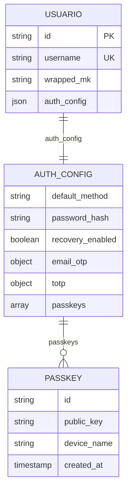
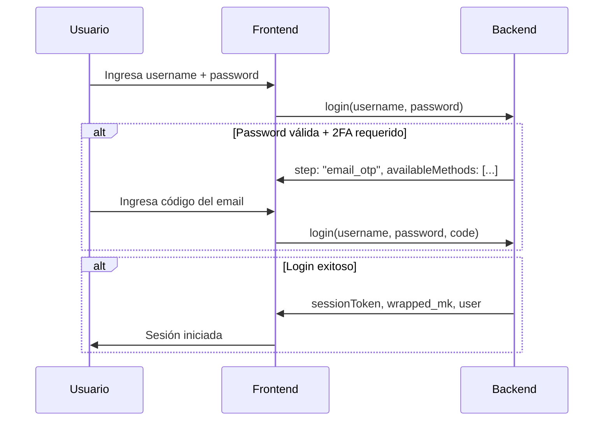
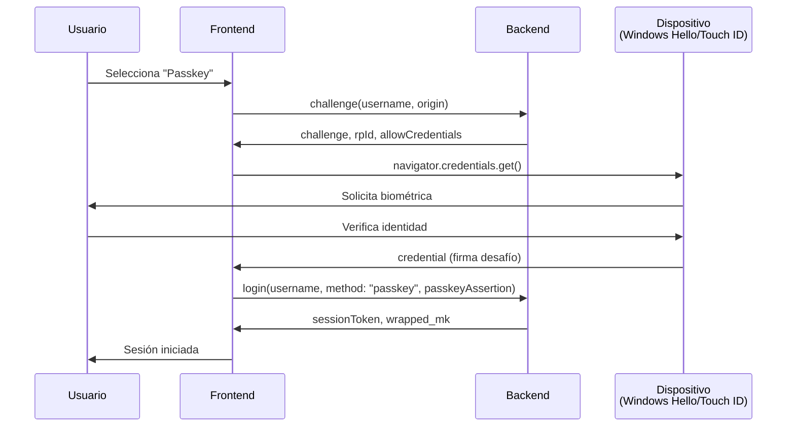
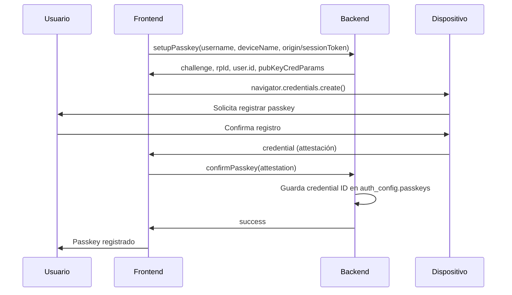
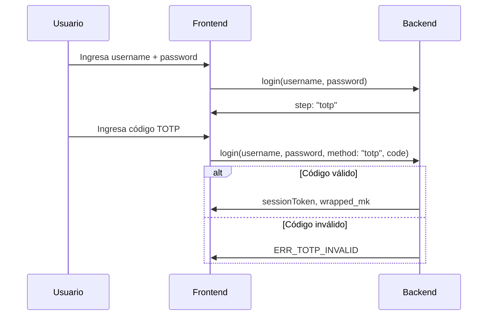
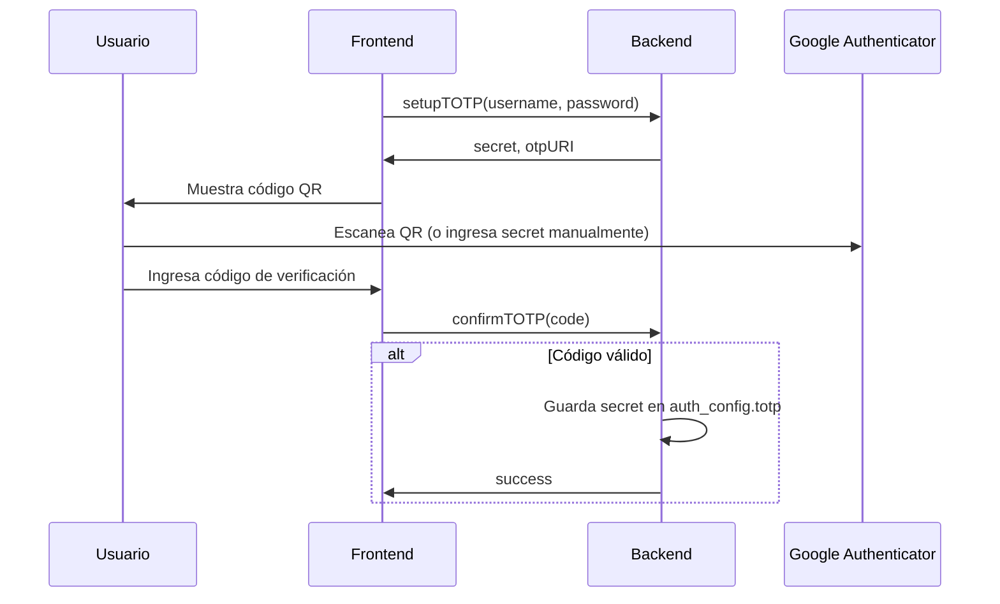
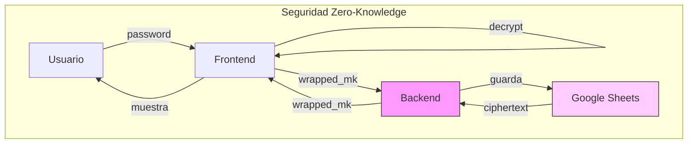

# Congre-Admin: Sistema de Autenticación

> **Versión:** 1.0.0
> **Última actualización:** 2026-03-30

---

## 1. Manifiesto del Sistema de Autenticación

### 1.1 Resumen

El sistema de autenticación de Congre-Admin implementa un modelo **Zero-Knowledge** donde el servidor nunca conoce las contraseñas ni las claves de cifrado de los usuarios. El sistema soporta múltiples métodos de autenticación configurables.

### 1.2 Métodos Soportados

| Método | Descripción | Estado |
|--------|-------------|--------|
| **Passkey (WebAuthn)** | Autenticación biométrica usando Windows Hello, Touch ID, etc. | ✅ Implementado |
| **TOTP** | Códigos temporales de Google Authenticator | ✅ Implementado |
| **Email OTP** | Códigos de un solo uso enviados por email | ✅ Implementado |
| **Password** | Contraseña tradicional (hash SHA-256) | ✅ Implementado |

### 1.3 Características de Seguridad

- **Zero-Knowledge:** El servidor solo almacena la Master Key cifrada (`wrapped_mk`), nunca la clave plana
- **2FA Obligatorio:** Email OTP siempre está habilitado como segundo factor
- **MFA Opcional:** Usuario puede habilitar Passkey y/o TOTP adicionalmente

---

## 2. Estructura de Datos de Auth

### 2.1 Campo `auth_config`

Toda la configuración de autenticación se almacena en el campo `auth_config` de la tabla Usuarios:

```json
{
  "default_method": "passkey",
  "password_hash": "sha256_hash_de_la_contraseña",
  "recovery_enabled": true,
  "email_otp": {
    "enabled": true,
    "created_at": "2026-03-29T10:56:40.158Z"
  },
  "totp": {
    "enabled": true,
    "secret": "REBZZYCVNCYWVNUBRENZ",
    "created_at": "2026-03-29T23:45:40.210Z"
  },
  "passkeys": [
    {
      "id": "base64url_encoded_credential_id",
      "public_key": "",
      "device_name": "Windows PC",
      "created_at": "2026-03-30T02:25:43.497Z"
    }
  ]
}
```

### 2.2 Diagrama de Entidades



---

## 3. Flujos de Autenticación

### 3.1 Flujo General de Login



### 3.2 Flujo de Login con Passkey



### 3.3 Flujo de Registro de Passkey



### 3.4 Flujo de Login con TOTP



### 3.5 Flujo de Configuración TOTP



---

## 4. Especificación de Interfaces

### 4.1 Archivos del Frontend

| Componente | Archivo | Descripción |
|------------|---------|-------------|
| **Login** | `modules/setup/views/Login.tsx` | Pantalla de login con selección de método |
| **SetupPasskey** | `modules/setup/views/SetupPasskey.tsx` | Registro de nuevo passkey |
| **SetupTOTP** | `modules/setup/views/SetupTOTP.tsx` | Configuración de TOTP |
| **AuthSettings** | `modules/settings/views/AuthSettings.tsx` | Gestión de métodos auth |

### 4.2 API del Backend

| Acción | Descripción |
|--------|-------------|
| `login` | Autenticación principal (password + MFA) |
| `register` | Crear nuevo usuario |
| `challenge` | Generar desafío para passkey login |
| `setupPasskey` | Generar desafío para registrar passkey |
| `confirmPasskey` | Confirmar registro de passkey |
| `deletePasskey` | Eliminar passkey |
| `setupTOTP` | Iniciar configuración de TOTP |
| `confirmTOTP` | Confirmar TOTP con código |
| `disableTOTP` | Desactivar TOTP |
| `requestOTP` | Enviar código por email |
| `getAuthMethods` | Obtener métodos habilitados |
| `updateAuthConfig` | Actualizar configuración |
| `changePassword` | Cambiar contraseña |
| `deleteAccount` | Eliminar cuenta |

---

## 5. Reglas de Negocio

### 5.1 Reglas de WebAuthn

| Regla | Descripción |
|-------|-------------|
| **rpId** | Se deriva del origen de la petición: `https://example.com` → `example.com` |
| **Challenge** | 32 bytes aleatorios codificados en base64 estándar |
| **user.id** | SHA-256 hash del username codificado en base64 |
| **excludeCredentials** | Evita registrar el mismo dispositivo dos veces |

### 5.2 Reglas de TOTP

| Parámetro | Valor |
|-----------|-------|
| Algoritmo | HMAC-SHA1 |
| Dígitos | 6 |
| Período | 30 segundos |
| Ventana de verificación | ±1 período (60s tolerancia) |
| Secret | Base32, 20 bytes (160 bits) |

### 5.3 Reglas de Email OTP

| Regla | Descripción |
|-------|-------------|
| Código | 6 dígitos aleatorios |
| TTL | 5 minutos |
| Envío | MailApp de GAS |
| Habilitado | Siempre por defecto en registro |

### 5.4 Seguridad



---

## 6. Códigos de Error

### Códigos de Autenticación

| Código | Descripción | Uso en api.gs |
|--------|-------------|---------------|
| `ERR_AUTH_INVALID` | Credenciales o sesión inválida | Login, passkey, TOTP, sesión expirada |
| `ERR_AUTH_REQUIRED` | Token de sesión no proporcionado | Acciones CRUD protegidas |
| `ERR_RATE_LIMITED` | Demasiados intentos (5/min) | Login, requestOTP |
| `ERR_USER_NOT_FOUND` | Usuario no existe | Login, register, CRUD usuarios |
| `ERR_USER_EXISTS` | Username ya registrado | Register |
| `ERR_PASSWORD_REQUIRED` | Contraseña no proporcionada | Login |
| `ERR_PASSWORD_WEAK` | Contraseña no cumple complejidad | Register, changePassword |
| `ERR_INVALID_CREDENTIALS` | Credenciales vacías o incorrectas | Login, changePassword, deleteAccount |
| `ERR_CODE_REQUIRED` | Código TOTP/email no proporcionado | Login (verificación MFA) |
| `ERR_TOTP_NOT_CONFIGURED` | TOTP no configurado para el usuario | Login |
| `ERR_TOTP_EXPIRED` | Configuración TOTP pendiente expirada | confirmTOTP |
| `ERR_NO_PENDING_TOTP` | No hay setup TOTP pendiente | confirmTOTP |
| `ERR_EMAIL_OTP_NOT_CONFIGURED` | Email OTP no configurado | Login |
| `ERR_EMAIL_REQUIRED` | Email no proporcionado | Register |
| `ERR_EMAIL_INVALID` | Formato de email inválido | Register |
| `ERR_EMAIL_SEND` | Error al enviar email | requestOTP, welcome, reset |
| `ERR_PASSKEY_NOT_CONFIGURED` | Passkey no registrado | Login |
| `ERR_PASSKEY_REQUIRED` | Autenticación passkey requerida | Login |
| `ERR_PASSKEY_NOT_FOUND` | Passkey no coincide | deletePasskey |
| `ERR_PASSKEY_SETUP_EXPIRED` | Configuración de passkey expiró | confirmPasskey |
| `ERR_SESSION_EXPIRED` | Sesión expirada | validateSession |
| `ERR_SESSION_NOT_FOUND` | Sesión no encontrada | validateSession |
| `ERR_INVALID_TOKEN` | Token de reset inválido o expirado | resetPassword |
| `ERR_TOKEN_EXPIRED` | Token de reset ha expirado | resetPassword |
| `ERR_INVALID_REQUEST` | Datos incompletos | resetPassword |
| `ERR_PERMISSION_DENIED` | Sin permisos RBAC | checkPermission |
| `ERR_VERSION_CONFLICT` | Conflicto de versión (Last Write Wins) | saveData |
| `ERR_PROFILE_EXISTS` | ID de perfil ya existe | createProfile |
| `ERR_PROFILE_NOT_FOUND` | Perfil no encontrado | updateProfile, deleteProfile |
| `ERR_PROFILE_IN_USE` | Perfil tiene usuarios asignados | deleteProfile |

> **Nota:** Los docs anteriores definían `ERR_TOTP_REQUIRED` y `ERR_TOTP_INVALID`. En la implementación real, estos se usan como `ERR_CODE_REQUIRED` (código no ingresado) y `ERR_AUTH_INVALID` (código incorrecto).

---

## 7. Archivos Relacionados

| Archivo | Descripción |
|--------|-------------|
| `Backend_API_Completa.md` | Documentación completa de la API |
| `Tecnologia.md` | Especificación de criptografía |
| `Core.md` | Arquitectura del núcleo |

---

*Documento generado el 2026-03-30*
