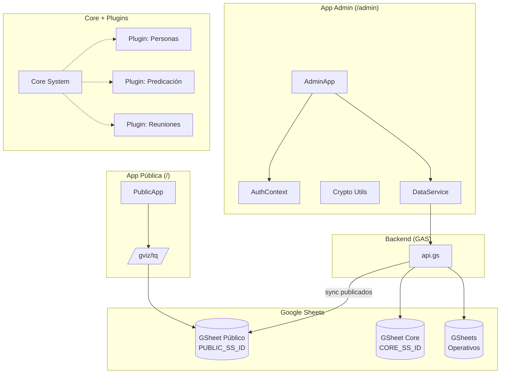
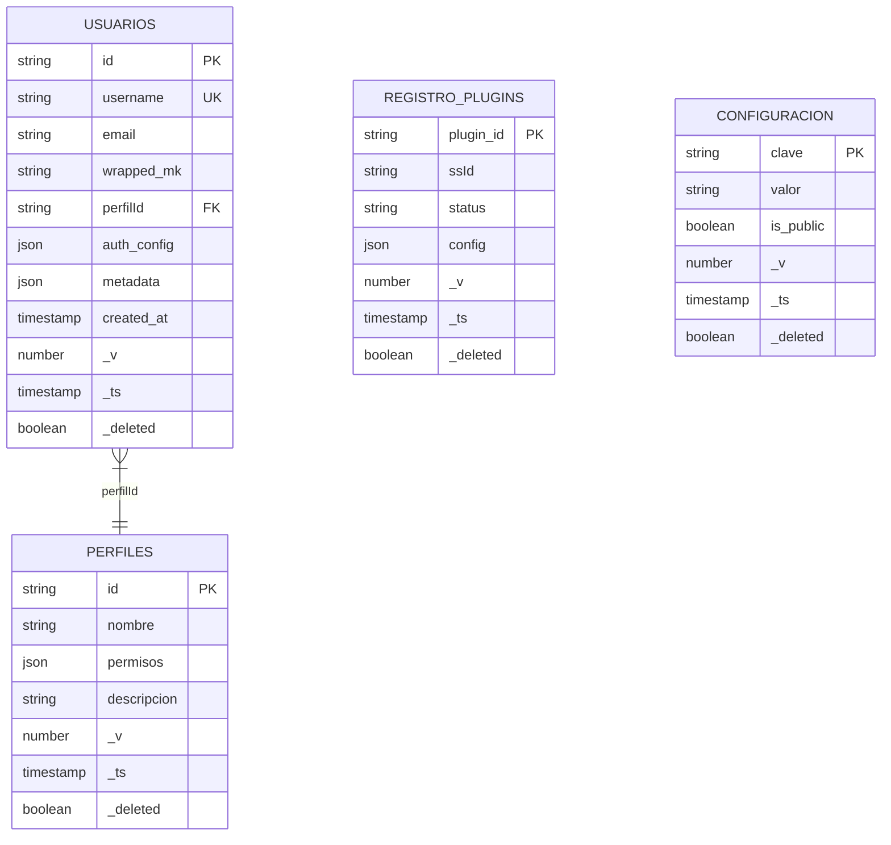
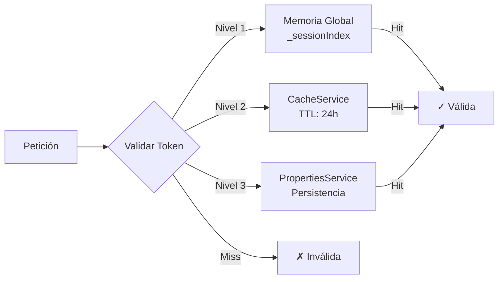
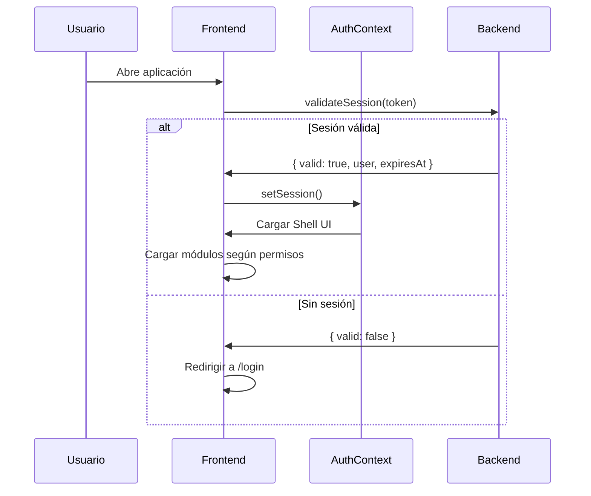
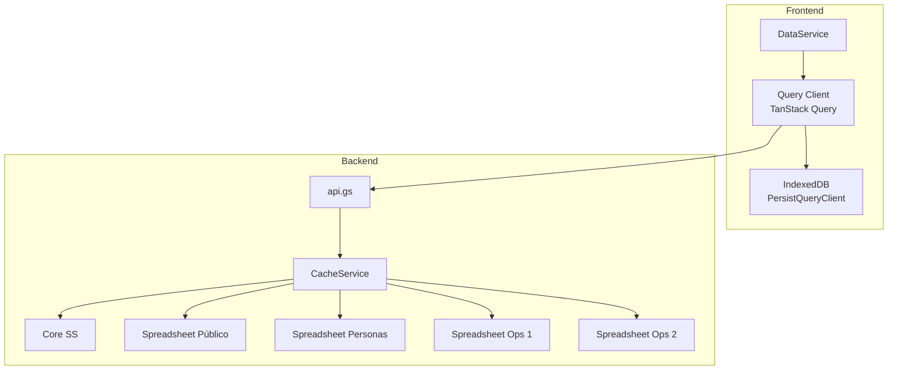
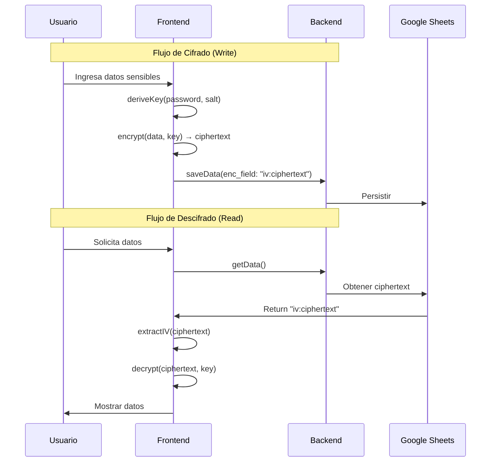

# Congre-Admin: Arquitectura del Núcleo (Core)

> **Versión:** 1.0.0
> **Última actualización:** 2026-03-30

---

## 1. Manifiesto del Núcleo

### 1.1 Definición del Sistema Core

El **Core** (Núcleo) de Congre-Admin es el sistema central que orquesta toda la aplicación. Acts as the backbone that provides authentication, navigation, data orchestration, and security for all pluggable modules.

### 1.2 Capacidades Principales

| Capacidad | Descripción |
|-----------|-------------|
| **Autenticación** | Gestión de usuarios, sesiones y múltiples métodos de login (Passkey, TOTP, Email OTP) |
| **Autorización** | Sistema RBAC basado en perfiles con permisos por módulo |
| **Navegación** | Shell UI con sidebar dinámica según permisos del usuario |
| **Cifrado** | Implementación Zero-Knowledge con AES-GCM |
| **Datos** | Orquestación de múltiples spreadsheets (Core, Público, Personas, Operativos) |
| **Extensibilidad** | Sistema de plugins dinámicos |

### 1.3 Arquitectura General



**ssIds separados:**
- `PUBLIC_SS_ID` → GSheet Público (solo lectura pública, sin auth)
- `CORE_SS_ID` → GSheet Core (configuración, usuarios, permisos)
- Cada GSheet Operativo tiene su propio `spreadsheet_id`

---

## 2. Estructura de Datos del Core

### 2.1 GSheet Core Tables

El Core utiliza un Google Spreadsheet maestro que contiene las siguientes tablas:



### 2.2 Estructura de `auth_config`

El campo `auth_config` en la tabla Usuarios es un objeto JSON que contiene toda la configuración de autenticación:

```json
{
  "default_method": "passkey",
  "password_hash": "sha256_hash",
  "recovery_enabled": true,
  "email_otp": {
    "enabled": true,
    "created_at": "2026-03-29T10:56:40.158Z"
  },
  "totp": {
    "enabled": true,
    "secret": "BASE32_SECRET",
    "created_at": "2026-03-29T23:45:40.210Z"
  },
  "passkeys": [
    {
      "id": "base64url_credential_id",
      "public_key": "",
      "device_name": "Windows PC",
      "created_at": "2026-03-30T02:25:43.497Z"
    }
  ]
}
```

### 2.3 Estructura de `metadata`

El campo `metadata` en la tabla Usuarios es un objeto JSON que almacena información adicional del usuario:

```json
{
  "last_login": "2026-03-30T10:00:00Z",
  "last_password_change": "2026-03-01T08:30:00Z",
  "failed_login_attempts": 0,
  "created_from_ip": "192.168.1.1"
}
```

| Campo | Tipo | Descripción |
|-------|------|-------------|
| `last_login` | ISO 8601 | Fecha y hora del último inicio de sesión |
| `last_password_change` | ISO 8601 | Fecha y hora del último cambio de contraseña |
| `failed_login_attempts` | número | Contador de intentos de inicio de sesión fallidos |
| `created_from_ip` | string | Dirección IP desde donde se creó la cuenta |

### 2.4 Gestión de Sesiones

El sistema usa un índice híbrido de 3 niveles para validar sesiones:



| Nivel | Almacenamiento | TTL | Propósito |
|-------|----------------|-----|-----------|
| 1 | Variable global `_sessionIndex` | Runtime | Acceso instantáneo |
| 2 | `CacheService` | 24 horas | Persistencia entre requests |
| 3 | `PropertiesService` | Permanente | Backup/recuperación |

---

## 3. Flujo de Trabajo

### 3.1 Carga de la Aplicación



### 3.2 Orquestación de Datos



### 3.3 Cifrado Zero-Knowledge



---

## 4. Especificación de Interfaces

### 4.1 Componentes del Core (Estructura Objetivo)

| Componente | Archivo | Descripción | Estado |
|------------|---------|-------------|--------|
| **Shell** | `core/shell/Shell.tsx` | Layout principal con Sidebar + Navbar | ✅ |
| **AuthContext** | `core/context/AuthContext.tsx` | Gestión de sesión y autenticación | ✅ |
| **Sidebar** | `core/components/Layout/Sidebar.tsx` | Navegación dinámica según permisos | ✅ |
| **Navbar** | `core/components/Layout/Navbar.tsx` | Barra superior con user menu | ✅ |
| **DataService** | `services/dataService.ts` | Adaptador para API del backend | ✅ |
| **CacheService** | `cache/cacheService.ts` | Caché Memory + localStorage + 24h expiry | ✅ |
| **CryptoUtils** | `core/crypto/cryptoUtils.ts` | Funciones AES-GCM, PBKDF2 | ✅ |
| **Theme** | `core/theme/theme.ts` | Configuración MUI (Light/Dark) | ✅ |

### 4.2 Estructura de Archivos (Estructura Objetivo)

```
frontend/src/
├── main.tsx                        # Router (/ → PublicApp, /admin → AdminApp)
├── index.css
├── core/                           # Motor del sistema (compartido entre ambas apps)
│   ├── context/
│   │   └── AuthContext.tsx
│   ├── crypto/
│   │   └── cryptoUtils.ts
│   ├── shell/
│   │   └── Shell.tsx
│   ├── theme/
│   │   └── theme.ts
│   └── components/
│       └── Layout/
│           ├── Sidebar.tsx
│           └── Navbar.tsx
├── modules/                        # Módulos del sistema
│   ├── setup/views/                # SetupWizard, Login, SetupTOTP, SetupPasskey
│   ├── dashboard/views/            # Dashboard
│   ├── admin/views/                # BackupExport
│   └── settings/views/             # AuthSettings
├── services/                       # ✅ Implementado (dataService, dataTransformService, authService, publicService)
├── cache/                          # ✅ Implementado (cacheService - Memory + localStorage + 24h expiry)
├── types/                          # ✅ Implementado (auth, user, data, config)
├── admin/                          # App de administración
│   └── AdminApp.tsx
└── public/                         # App pública (guest access)
    ├── App.tsx
    ├── main.tsx
    └── index.css
```

> **⚠️ Migración pendiente:** La implementación actual tiene el core bajo `admin/core/` y los módulos bajo `admin/modules/`. Se requiere moverlos a `core/` y `modules/` en la raíz de `src/`. Ver [Estructura_Proyecto.md §7](./Estructura_Proyecto.md) para los pasos detallados.

### 4.3 Reglas de Importación

- **Módulos pueden importar de Core:** ✅ `@core/*` (desde `core/`)
- **Core NO puede importar de Módulos:** ❌ (debe usar lazy loading)
- **App Pública:** Solo importa `theme.ts` del Core. No usa `AuthContext` ni módulos.

---

## 5. Reglas de Negocio

### 5.1 Motor JSONata

El Core proporciona variables globales para todas las expresiones JSONata:

| Variable | Descripción | Ejemplo |
|----------|-------------|---------|
| `$personas` | Listado completo de personas | `$personas[nombre ~> /Pérez/]` |
| `$config` | Diccionario de configuración | `$config.idioma_predeterminado` |
| `$usuario` | Sesión activa | `$usuario.perfilId` |
| `$ahora` | Fecha/hora actual | `$ahora` |

### 5.2 Reglas de Cifrado

- **Campos sensibles:** Prefijo `enc_` (ej: `enc_telefono`, `enc_direccion`)
- **Formato:** `iv:ciphertext` (IV hex + ciphertext hex)
- **Algoritmo:** AES-GCM 256-bit
- **KDF:** PBKDF2-HMAC-SHA256, 600,000 iteraciones

### 5.3 Permisos RBAC

| Perfil | Módulos con Acceso |
|--------|-------------------|
| `p_admin` | RW en todos |
| `p_secretario` | RW: personas, registros, anuncios; R: reuniones, predicación |
| `p_comite` | R: personas, registros, reuniones, predicación |
| `p_super_grupo` | R: personas; RW: registros |
| `p_siervo_territorios` | RW: predicación |
| `p_publicador` | R: reuniones, predicación |

---

## 6. Archivos Relacionados

| Archivo | Descripción |
|--------|-------------|
| `Backend.md` | Especificación del backend |
| `Backend_API_Completa.md` | API completa del backend |
| `DataService.md` | Cliente frontend (DataService, CacheService, JSONata, TanStack Query) |
| `Tecnologia.md` | Especificación tecnológica |
| `Autenticacion.md` | Sistema de autenticación |

---

*Documento generado el 2026-03-30*
