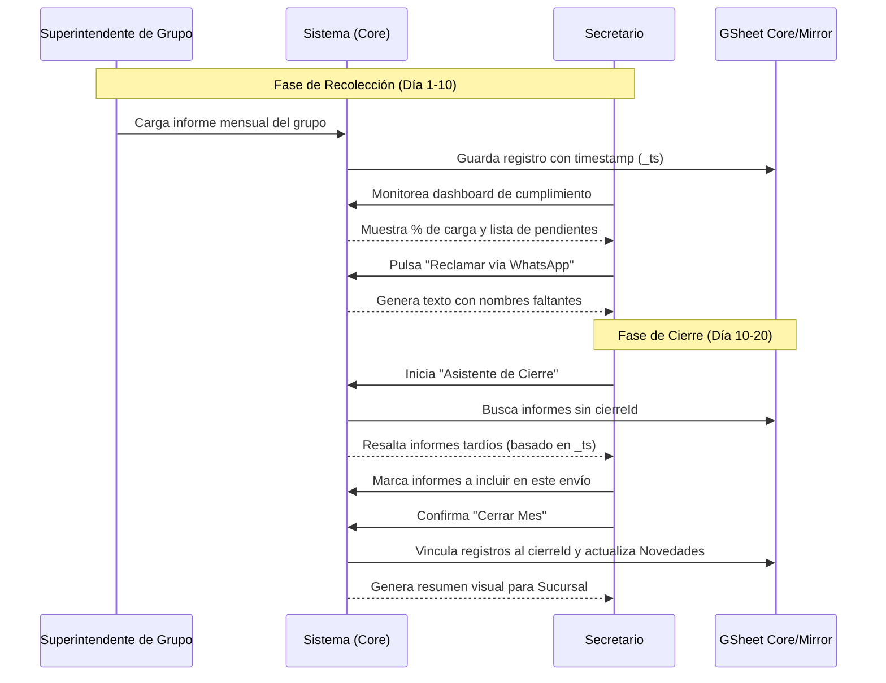
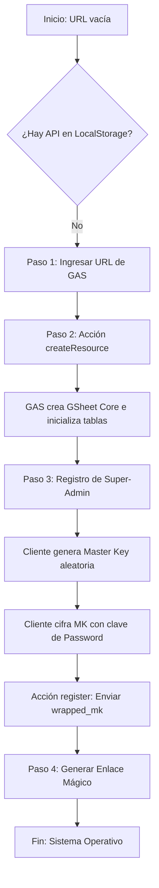
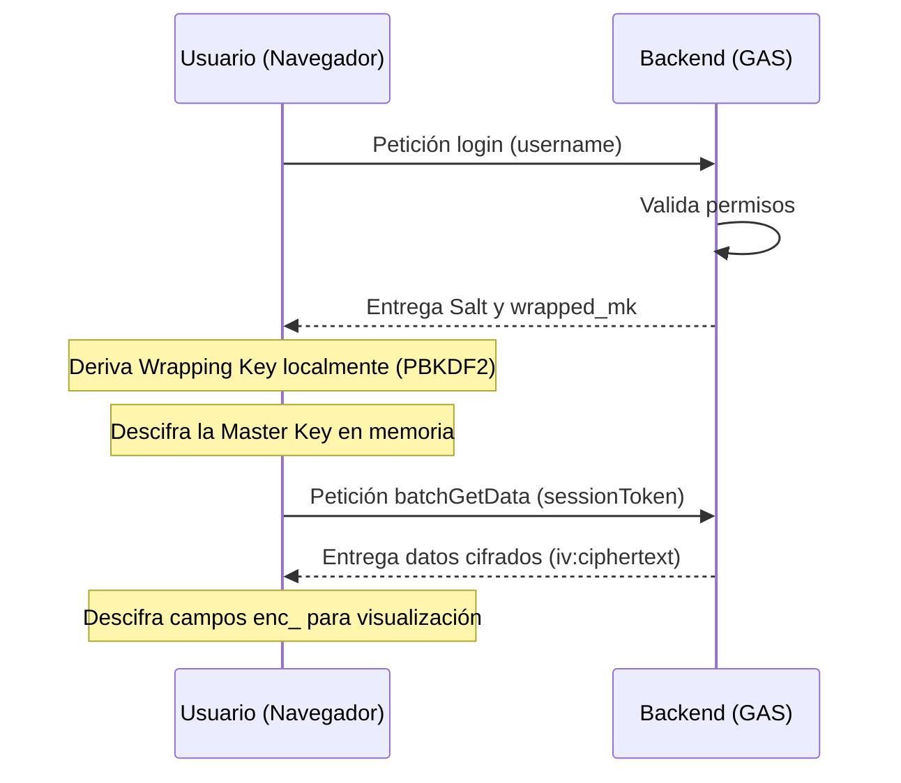
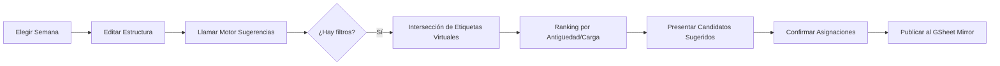

# Congre-Admin: Diagramas de Procesos y Workflows

Este documento describe visualmente los flujos de trabajo críticos del sistema utilizando la sintaxis de Mermaid.

## 1. Ciclo Mensual de Informes (Día 1 al 20)
Describe la interacción entre los responsables de grupo y el secretario para el cierre oficial.

## 2. Proceso de Instalación (Setup Wizard)
Flujo de configuración inicial para una nueva congregación.

## 3. Handshake de Conocimiento Cero (Login)
Cómo se recupera la llave maestra sin enviarla nunca al servidor.

## 4. Confección de Programa de Reuniones
Flujo de trabajo para el Superintendente de Reunión VyM.

