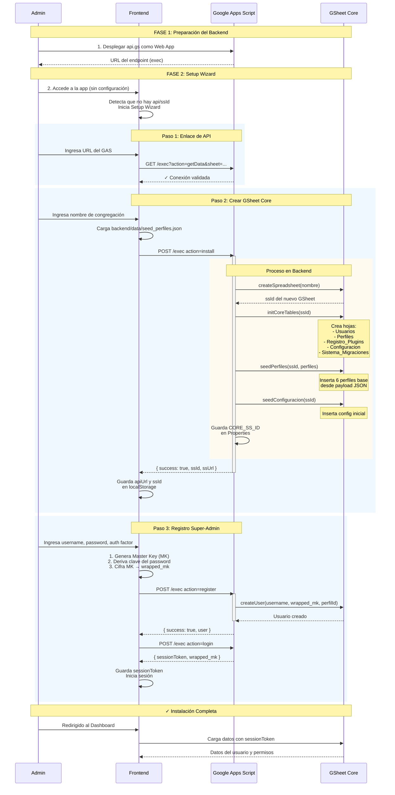

# Congre-Admin: Guía de Instalación y Configuración Inicial

Este documento describe el flujo de trabajo para poner en marcha una nueva instancia del sistema (Setup Wizard).

## 1. Fase 1: Preparación del Backend
1. **Crear Google Script:** El administrador crea un nuevo proyecto de Apps Script y pega el contenido de `api.gs`.
2. **Desplegar como Web App:** Se publica con acceso para "Cualquiera".
3. **Copiar URL:** Se obtiene la URL de ejecución (ej: `https://script.google.com/.../exec`).

### Diagrama del Proceso de Instalación



### Flujo Resumido

```
┌─────────────────────────────────────────────────────────────────────┐
│                    FASE 1: PREPARACIÓN                              │
├─────────────────────────────────────────────────────────────────────┤
│  1. Crear proyecto Google Apps Script                              │
│  2. Pegar código de api.gs                                        │
│  3. Desplegar como Web App (Cualquiera)                           │
│  4. Obtener URL → https://script.google.com/.../exec              │
└─────────────────────────────────────────────────────────────────────┘
                              ↓
┌─────────────────────────────────────────────────────────────────────┐
│                    FASE 2: SETUP WIZARD                            │
├─────────────────────────────────────────────────────────────────────┤
│  Paso 1: Enlace de API                                            │
│  └─ Frontend valida conexión con backend                          │
│                              ↓                                      │
│  Paso 2: Crear GSheet Core                                        │
│  ├─ Frontend carga seed_perfiles.json                             │
│  ├─ POST install (nombreCongregacion, perfiles)                  │
│  ├─ Backend: createSpreadsheet → initCoreTables → seedPerfiles    │
│  └─ Backend retorna ssId                                          │
│                              ↓                                      │
│  Paso 3: Registro Super-Admin                                     │
│  ├─ Frontend genera Master Key                                    │
│  ├─ POST register (username, wrapped_mk)                         │
│  └─ POST login → Obtiene sessionToken                             │
└─────────────────────────────────────────────────────────────────────┘
                              ↓
┌─────────────────────────────────────────────────────────────────────┐
│                    ✓ INSTALACIÓN COMPLETA                          │
│  - GSheet Core creado con tablas y perfiles                       │
│  - Usuario admin registrado                                       │
│  - Sesión activa                                                  │
└─────────────────────────────────────────────────────────────────────┘
```

## 2. Fase 2: El Asistente de Configuración (Setup UI)
Cuando el frontend detecta que no hay `api` ni `ssId` en `localStorage`, lanza el **Setup Wizard**:

### Paso 1: Enlace de API
- **Input:** URL del Google Apps Script.
- **Acción:** El frontend realiza un `ping` (vía `doGet`) para validar la conexión.

### Paso 2: Creación del Orquestador (GSheet Core)
- **Opción A (Recomendada):** El frontend solicita al backend crear una nueva hoja mediante la acción `createSpreadsheet`. 
    - **Acción:** El backend ejecuta `SpreadsheetApp.create('CongreAdmin_Core')` y devuelve el `ssId`.
    - **Provisión:** El backend inicializa automáticamente las tablas `Usuarios`, `Perfiles`, `Registro_Plugins` y `Configuracion` con sus cabeceras mediante `initCoreTables`.
    - **Seed Data de Perfiles:** 
        - El frontend carga el archivo `backend/data/seed_perfiles.json` que contiene los perfiles base.
        - Los perfiles se envían en el payload de la acción `install` al backend.
        - Perfiles base injectados:
            *   `p_admin` - Super-Admin (Acceso total)
            *   `p_secretario` - Secretario (Gestión de personas y registros)
            *   `p_comite` - Comité de Servicio (Supervisión general)
            *   `p_super_grupo` - Superintendente de Grupo (Informes y atención de grupo)
            *   `p_siervo_territorios` - Siervo de Territorios (Gestión de territorios y mapas)
            *   `p_publicador` - Publicador (Acceso básico)
    - **Seed Data de Configuración:** Se injectan configuraciones iniciales (nombre congregación, idioma, año de servicio, versión).
- **Opción B:** Vincular una GSheet existente proporcionando su ID manualmente.

### Paso 3: Registro del Super-Admin
- **Input:** Username, Password (para derivar la Master Key inicial) y Factor de Auth (TOTP/Passkey).
- **Acción:** 
    1. El cliente genera una **Master Key (MK)** aleatoria de 256 bits.
    2. Cifra la MK con la clave derivada del password -> `wrapped_mk`.
    3. Envía `register` al backend con el `username` y `wrapped_mk`.

## 3. Fase 3: Provisión de Plugins
Una vez logueado, el Admin accede al panel de "Administración del Sistema":
1. **Seleccionar Plugin:** (ej: `predicacion_territorios`).
2. **Proporcionar ssId:** ID de una nueva GSheet para ese plugin.
3. **Inicializar:** 
    - El Core envía el esquema del plugin al backend para crear las tablas necesarias (`initSheet`).
    - El Core detecta si el plugin tiene **Seed Data** y realiza una carga inicial de datos (plantillas, catálogos) para que el módulo sea operativo inmediatamente.

## 4. Persistencia del Acceso
El sistema genera un enlace de acceso rápido:
`https://congre-admin.pages.dev/?api=[URL_ENC]&ssId=[ID_ENC]`
*Este enlace permite a otros administradores configurar sus dispositivos instantáneamente.*
