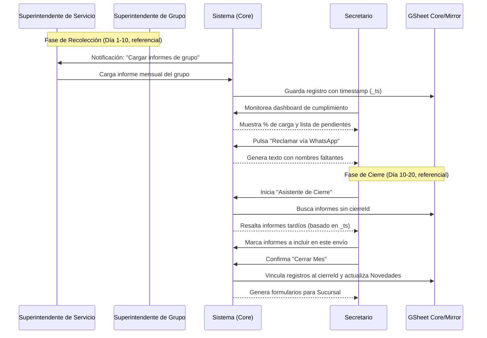

# Congre-Admin: Plug-in de Registros e Informes

Este módulo gestiona el historial de actividad de los publicadores, la recolección mensual de informes de predicación, el registro de asistencia y la contabilidad administrativa (Novedades) para la sucursal y la visita del Superintendente de Circuito.

## 1. Manifiesto del Módulo
-   **ID:** `admin_registros`
-   **Sección:** `Administración`
-   **Icono:** `assignment`
-   **Navegación:**
    -   `{ "menu": "Registros", "titulo": "Registros de publicador", "icono": "shield_lock", "ruta": "/registros", "publico": false, "pestañas": [
        { "menu": "Publicadores", "titulo": "Registros de Publicadores", "ruta": "/registros/publicadores", "permisos": ["editor", "admin"] },
        { "menu": "Resumen", "titulo": "Resumen de Actividad", "ruta": "/registros/resumen", "permisos": ["editor", "admin"] },
        { "menu": "Movimientos", "titulo": "Movimientos de Publicadores", "ruta": "/registros/movimientos", "permisos": ["admin"] },
        { "menu": "Reuniones", "titulo": "Asistencia a Reuniones", "ruta": "/registros/reuniones", "permisos": ["editor", "admin"] }
      ] }`
    -   `{ "menu": "Informes", "titulo": "Informes de predicación", "icono": "shield_lock", "ruta": "/informes", "publico": false, "pestañas": [
        { "menu": "Grupo", "titulo": "Informes por Grupo", "ruta": "/informes/grupo", "permisos": ["editor"] },
        { "menu": "Congregación", "titulo": "Informes de Congregación", "ruta": "/informes/congregacion", "permisos": ["admin"] }
      ] }`
    -   `{ "menu": "Cierre", "titulo": "Cierre mensual", "icono": "analytics", "ruta": "/cierre", "publico": false, "pestañas": [
        { "menu": "Estado", "titulo": "Estado de Carga", "ruta": "/cierre/estado", "permisos": ["admin"] },
        { "menu": "Cierre", "titulo": "Generar Cierre", "ruta": "/cierre/generar", "permisos": ["admin"] },
        { "menu": "Visita SC", "titulo": "Visita del Superintendente", "ruta": "/cierre/visita-sc", "permisos": ["admin"] }
      ] }`
    -   `{ "menu": "Asistencia", "titulo": "Asistencia a reuniones", "icono": "shield_lock", "ruta": "/asistencia", "publico": false, "seccionPadre": "Reuniones" }`
-   **Permisos:** `admin` (Secretario), `editor` (Superintendentes de Grupo).
-   **Tablas Requeridas:** `Registros_Historicos`, `Informes_Mensuales`, `Asistencia_Reuniones`, `Cierres_Mensuales`, `Novedades`.
-   **Reportes:**
    -   `{ "id": "S-21-S", "nombre": "Registro de Publicador (3 años)", "tipo": "pdf_overlay", "template": "./assets/templates/S-21_S.pdf", "mapping": "3_service_years_consolidated" }`
    -   `{ "id": "S-3-S", "nombre": "Informe Mensual de Asistencia", "tipo": "pdf_form", "template": "./assets/templates/S-3_S.pdf", "mapping": "monthly_attendance_summary" }`
    -   `{ "id": "TOTALES_CONGRE", "nombre": "Informe a la Sucursal (Cierre Mensual)", "tipo": "dynamic_html", "mapping": "branch_report_workflow" }`
    -   `{ "id": "MOVIMIENTOS_SC", "nombre": "Movimientos de Publicadores (Visita SC)", "tipo": "dynamic_html", "mapping": "publisher_movements" }`
-   `{ "id": "DATOS_CONTACTO_SC", "nombre": "Datos de contacto para el Superintendente de Circuito", "tipo": "dynamic_html", "mapping": "active_publishers_contact_list" }`
-   `{ "id": "DIRECTORIO_EMERGENCIA", "nombre": "Directorio de Emergencia para Ancianos (Offline)", "tipo": "dynamic_html", "mapping": "emergency_contact_list" }`

## 2. Estructura de Datos (Esquema)

### Informe Mensual (`Informes_Mensuales`)
~~~json
{
    "id": "inf_2026_03_e1",
    "personaId": "e1",
    "mes": "2026-03",
    "cierreId": null,
    "participo": true,
    "estudios": 1,
    "auxiliar": false,
    "notas": "...",
    "_ts": "2026-03-05T10:00:00Z" 
}
~~~

### Tabla de Novedades (`Novedades`)
Registro flexible de hitos administrativos y cambios en el censo (Movimientos).
~~~json
{
    "id": "nov_001",
    "fecha": "2026-03-10",
    "categoria": "PUBLICADORES", // PUBLICADORES | SUCURSAL | VISITA_SC | OTROS
    "tipo": "BAJA", // ALTA | BAJA | EVENTO | NOTA
    "personaId": "e1", // Opcional
    "impacto": -1, // +1, -1 o 0
    "detalle": {
        "motivo": "Mudanza",
        "datos_extra": {} 
    },
    "enc_comentario": "iv:...", 
    "cierreId": null 
}
~~~

### Cierre Mensual (`Cierres_Mensuales`)
~~~json
{
    "id": "cier_2026_03",
    "mesContable": "2026-03",
    "fechaCierre": "2026-03-18T10:00:00Z",
    "enviadoPor": "u1",
    "resumen": { "cat_A": 10, "cat_B": 5, "cat_C": 80, "totalPublicadores": 95 }
}
~~~

### Registro de Asistencia (`Asistencia_Reuniones`)
~~~json
{
    "id": "ast_2026_03_01_vym",
    "semana": "2026-03-01",
    "tipoReunion": "entreSemana", // entreSemana | finDeSemana
    "total": 45,
    "comentarios": ""
}
~~~

## 3. Flujo de Trabajo (Workflow)

### A. Carga de Informes
La página "/informes" contiene dos pestañas:

- **Pestaña "Grupo"** (permiso: `editor`): Los superintendentes de grupo acceden a una interfaz filtrada solo para sus publicadores y cargan los datos del mes actual.

- **Pestaña "Congregación"** (permiso: `admin`): El secretario puede cargar informes de todos los publicadores de la congregación. Ver especificaciones detalladas en la Sección 4.

### B. Consolidación y Cierre Mensual (Secretario)
La página "/cierre" contiene dos pestañas:

- **Pestaña "Estado"**: Muestra el dashboard de cumplimiento con el estado de carga de informes. Ver especificaciones en Sección 4.
- **Pestaña "Cierre"**: Interfaz para generar el cierre mensual:
    1.  **Detección de Tardíos:** El sistema lista informes donde `cierreId == null`. Aquellos con `_ts > $fechaUltimoCierre` se resaltan como "Posteriores al último cierre".
    2.  **Inclusión Individual:** El Secretario marca qué informes (incluidos los tardíos) se consolidan en este envío.
    3.  **Ajuste de Novedades:** Se muestran las `Novedades` pendientes (ej: bajas por mudanza) para calcular el saldo final de publicadores.
    4.  **Cierre:** Se genera el reporte oficial y se asigna el `cierreId` a los informes y novedades seleccionados.

### C. Registro de Asistencia
**Ubicación en el menú:** `Reuniones` → `Asistencia` (`shield_lock`)

1.  **Selección de Semana:**
    -   El usuario selecciona una semana mediante un picker de fechas (se muestra la fecha del lunes).
    -   El sistema verifica si ya existen registros para esa semana y los carga si están disponibles.

2.  **Carga de Asistencia:**
    -   Dos campos de entrada numérica: uno para la reunión **entre semana** y otro para **fin de semana**.
    -   Campo de comentarios opcional para cada reunión (ej: "día festivo", "clima adverso", "asamblea").

3.  **Generación de Reporte Mensual:**
    -   El secretario selecciona un mes y año.
    -   El sistema compila los registros semanales y genera el formulario **S-3-S** (Informe Mensual de Asistencia).
    -   El PDF se descarga listo para firmar y enviar.

### D. Visita del Superintendente de Circuito (SC)
1.  **Movimientos de Publicadores:** El reporte filtrará la tabla `Novedades` desde la fecha de la última visita.
2.  **Resumen Contable:** Presentará el saldo inicial, el detalle cronológico de cada alta/baja con su comentario, y el saldo final.
3.  **Documentación:** Exportación masiva de S-21 y S-88 del periodo.

### E. Flujo de Trabajo - Ciclo Mensual



## 4. Especificación de Interfaces

### A. Cierre Mensual

#### A.1. Pestaña "Estado" (Dashboard de Cumplimiento)
- **Permiso requerido:** `admin`
- **Funcionalidades:**
    - **Widget de Plazo:** Contador de días restantes hasta el día 20 del mes.
    - **Nivel de Carga:** Gráfico de progreso por grupo de predicación.
    - **Lista de Pendientes:** Tabla mostrando publicadores que aún no han entregado informe.
    - **Acción de Reclamo (WhatsApp):** Botón por grupo que genera un listado de nombres que aún no han informado para enviar al Superintendente de Grupo.

#### A.2. Pestaña "Cierre" (Generar Cierre Mensual)
- **Permiso requerido:** `admin`
- **Funcionalidades:**
    - **Selector de Mes:** Dropdown para seleccionar el mes a cerrar.
    - **Resumen de Informes:**
        - Total de publicadores activos
        - Informes cargados vs pendientes
        - Informes tardíos (con `_ts > fechaUltimoCierre`)
    - **Lista de Informes sin Cerrar:** Tabla con checkboxes para seleccionar qué informes incluir.
    - **Novedades Pendientes:** Lista de movimientos (altas/bajas) sin cerrar.
    - **Vista Previa del Resumen:** Muestra el cálculo: saldo anterior + novedades = saldo final.
    - **Botón "Generar Cierre":** Crea el registro en `Cierres_Mensuales` y vincula los informes y novedades seleccionados.

#### A.3. Pestaña "Visita SC" (Visita del Superintendente de Circuito)
- **Permiso requerido:** `admin`
- **Funcionalidades:**
    - **Selector de Período:** Rango de fechas para la visita (desde última visita registrada)
    - **Resumen de Movimientos:** Tabla mostrando:
        - Saldo inicial de publicadores
        - Lista de movimientos (altas/bajas) con detalles: nombre, tipo, motivo, fecha
        - Saldo final de publicadores
    - **Documentación a generar:**
        - **Reporte de Movimientos:** PDF/HTML con el resumen de movimientos del período
        - **Lista de Publicadores:** Datos de contacto de los publicadores activos
        - **Formularios S-21:** Registro de publicador (descarga individual o lote)
        - **Formularios S-88:** Informe de servicio
    - **Acciones:**
        - Botón "Descargar Movimiento" (PDF del reporte)
        - Botón "Descargar Contactos" (lista de publicadores)
        - Botón "Descargar S-21" (individual o ZIP)
        - Botón "Descargar S-88"
        - Botón "Descargar Todo" (ZIP con toda la documentación)

### B. Informes de Predicación

La vista de informes de predicación está organizada en dos pestañas:

#### B.1. Pestaña "Grupo" (Superintendentes de Grupo)
- **Permiso requerido:** `editor`
- **Filtro automático:** Solo muestra publicadores asignados al grupo del usuario.
- **Funcionalidades:**
  - Selector de mes/año (predeterminado: mes actual).
  - Lista de publicadores del grupo con estado de informe (pendiente/cargado).
  - Formulario de carga: campos para participo, estudios, auxiliar, notas.
  - Botón "Guardar" que persiste el informe en `Informes_Mensuales`.

#### B.2. Pestaña "Congregación" (Secretario)
- **Permiso requerido:** `admin`
- **Acceso completo:** Puede ver y editar informes de TODOS los publicadores.
- **Funcionalidades:**
  - **Selector de Mes:** Dropdown para seleccionar el mes/año a consultar.
  - **Vista de Informes Cargados:** Tabla que muestra:
    - Nombre del publicador
    - Grupo al que pertenece
    - Estado (pendiente/cargado)
    - Fecha de carga (_ts)
    - Valores (participo, estudios, auxiliar)
  - **Acciones por fila:**
    - Si no hay informe: botón "Cargar" → abre formulario
    - Si hay informe: botón "Editar" → abre formulario con datos
  - **Formulario de Carga/Edición:**
    - Selector de publicador (buscable por nombre)
    - Checkbox: "¿Participó?"
    - Input numérico: "Estudios bíblicos"
    - Checkbox: "¿Precursor auxiliar?"
    - Textarea: "Notas"
    - Botón "Guardar" / "Actualizar"
  - **Indicadores visuales:**
    - Color verde: informe cargado
    - Color amarillo: pendiente
    - Color rojo: publicador inactivo sin informe

#### B.3. Reglas de Negocio de la Interfaz
- **Validación de mes único:** `$count(Informes_Mensuales[personaId = $personaId AND mes = $mes]) <= 1`
- **Cálculo de pendientes:** `$count(PublicadoresActivos) - $count(Informes_Mensuales[mes = $mes])`
- **Filtrado por grupo en pestaña Grupo:** `Informes_Mensuales[grupoId = $usuario.grupoId]`

### C. Registros

#### C.1. Pestaña "Publicadores" (Registros de Publicadores)
- **Permiso requerido:** `editor`, `admin`
- **Filtro por defecto:** Solo muestra publicadores del grupo del usuario (permiso editor). Admin ve todos.
- **Funcionalidades:**
    - **Tabla de Registros:** Vista de la "Tarjeta de Registro de Publicador" (S-21) digitalizada con el historial de los últimos años.
    - **Opciones de Organización:** Botones para ordenar por:
        - Precursores
        - Grupos
        - Alfabética
        - Inactivos
    - **Acciones:**
        - Ver detalle del registro
        - Descargar PDF individual (S-21-S)
        - Descargar lote filtrado en ZIP

#### C.2. Pestaña "Resumen" (Resumen de Actividad)
- **Permiso requerido:** `editor`, `admin`
- **Funcionalidades:**
    - **Totales de la Congregación:**
        - Total de publicadores
        - Total de precursoras
        - Total de publicadores mujeres
        - Total de publicadores hombres
    - **Promedios del Mes:**
        - Promedio de asistentes entre semana
        - Promedio de asistentes fin de semana
        - Total de estudios bíblicos
    - **Desglose por Categoría:**
        - Publicadores: total, promedio de horas, promedio de revisiones
        - Precursores regulares: total, promedio de horas
        - Precursores especiales: total, promedio de horas
    - **Gráficos Visuales:** Barras o líneas showing tendencias históricas

#### C.3. Pestaña "Movimientos" (Gestión de Movimientos)
- **Permiso requerido:** `admin`
- **Funcionalidades:**
    - **Formulario de Alta/Baja:**
        - Selector de publicador
        - Tipo de movimiento: Alta, Baja, Cambio de grupo
        - Motivo: Bautismo, Mudanza, Fallecimiento, Inactivo, etc.
        - Fecha del movimiento
        - Comentario opcional
    - **Registro de Novedades:** Lista historial de todos los movimientos registrados
    - **Filtros:** Por tipo, por fecha, por grupo

#### C.4. Pestaña "Reuniones" (Consulta de Asistencia)
- **Permiso requerido:** `editor`, `admin`
- **Descripción:** Vista de solo consulta para visualizar y descargar registros de asistencia. La gestión/carga de asistencia se encuentra en la Sección D.
- **Funcionalidades:**
    - **Selector de Período:** Semana o mes
    - **Vista de Registros:** Tabla mostrando:
        - Fecha
        - Tipo de reunión (entre semana / fin de semana)
        - Total de asistentes
        - Comentarios
    - **Botón "Descargar PDF":** Genera formulario S-3-S para el período seleccionado

### D. Asistencia a Reuniones (Gestión)
-   **Selector de Semana:** Input de fecha que muestra el calendario y resalta semanas con registros existentes.
-   **Formulario de Carga:**
    -   Dos filas con: Fecha (solo lectura), Tipo de Reunión (etiqueta), Input numérico para el total, Textarea para comentarios.
    -   Botón "Guardar" que persiste ambos registros simultáneamente.
-   **Historial Semanal:** Lista de semanas anteriores con opción de editar o ver detalles.
-   **Generador de Reportes:**
    -   Selector de mes/año.
    -   Botón "Generar S-3-S" que descarga el PDF con la tabla de asistencia consolidada.

## 5. Reglas de Negocio (JSONata)

### Resúmenes y Promedios
-   **Resumen de Grupo:** `$sum(informes[grupoId = $id].estudios)`
-   **Promedio Mensual de Asistencia:**
    ```jsonata
    $asistencia[mes = $mesSeleccionado].total / $count($asistencia[mes = $mesSeleccionado])
    ```
-   **Validación de Semana Única:**
    ```jsonata
    $count(asistencia[semana = $semana]) = 0
    ```

### Categorización y Cierre
- **Filtro de Informes Disponibles:** `Informes_Mensuales[cierreId = null]` (En la UI, resaltar si `_ts > $ultimoCierre.fechaCierre`).
- **Cálculo de Saldo para el SC:** `$saldoInicial + $sum(Novedades[fecha > $fechaUltimaVisita].impacto)`

### Informes por Congregación
- **Informe existe:** `$count(Informes_Mensuales[personaId = $pid AND mes = $mes]) > 0`
- **Publicadores pendientes:** `$count(Publicadores[estado = "activo"]) - $count(Informes_Mensuales[mes = $mes])`
- **Resumen por grupo:**
  ```jsonata
  $map($group(informes, $.grupoId), {"grupo": $.key, "total": $count($.value)})
  ```
