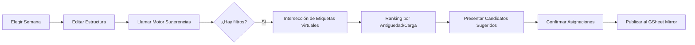

# Congre-Admin: Programa de Reuniones

Este plug-in gestiona la creación, personalización y difusión de los programas semanales de reuniones mediante un sistema de plantillas jerárquicas y herramientas de asignación inteligente.

## 1. Manifiesto del Módulo
-   **ID:** `reuniones_programa`
-   **Sección:** `Reuniones`
-   **Icono:** `event_note`
-   **Dependencias:** `[]`
-   **Navegación:**
    -   `{ "nombre": "Programa", "icono": "public", "ruta": "/visor", "publico": true }`
    -   `{ "nombre": "Administrar programa", "icono": "shield_lock", "ruta": "/confeccion", "publico": false }`
    -   `{ "nombre": "Ajustes de programa", "icono": "shield_lock", "ruta": "/ajustes", "publico": false }`
-   **Permisos:** `admin` (Confección/Ajustes), `view` (Público).
-   **Tablas Requeridas:** `Plantillas_Semanas`, `Plantillas_Reuniones`, `Plantillas_Secciones`, `Plantillas_Partes`, `Programas_Semanales`.

## 2. Estructura de Datos (Esquema)

### A. Plantillas Jerárquicas

#### 1. Plantilla de Semana
~~~json
{
    "id": "s1",
    "semana": "Normal",
    "fechaInicio": "", "fechaFin": "",
    "reuniones": ["r1", "r2"]
}
~~~
- **id:** Identificador único de la plantilla de semana.
- **semana:** Nombre descriptivo de la plantilla (ej: "Normal", "Visita", "Asamblea").
- **fechaInicio** y **fechaFin:** Placeholders para definir el rango de fechas que abarca un programa real.
- **reuniones:** Lista ordenada de IDs de las plantillas de reunión que incluye.

#### 2. Plantilla de Reunión
~~~json
{
    "id": "r1",
    "reunion": "Reunión de entre semana",
    "secciones": ["c1", "c2", "c3"]
}
~~~
- **id:** Identificador único de la plantilla de reunión.
- **reunion:** Nombre de la reunión.
- **secciones:** Lista ordenada de IDs de las plantillas de sección que incluye.

#### 3. Plantilla de Sección
~~~json
{
    "id": "c1",
    "seccion": "Tesoros de la Biblia",
    "mostrarEncabezado": true,
    "color": "#cccccc",
    "partes": ["p1", "p2", "p3"]
}
~~~
- **id:** Identificador único de la plantilla de sección.
- **seccion:** Nombre de la sección (ej: "Tesoros", "Apliquémonos").
- **mostrarEncabezado:** Booleano que define si se muestra el título de la sección en el programa final.
- **color:** Color identificativo para la interfaz (opcional).
- **partes:** Lista ordenada de IDs de las plantillas de parte que incluye.

#### 4. Plantilla de Parte (Roles Dinámicos)
~~~json
{
    "id": "p1",
    "parte": "Lectura de la Biblia",
    "descripcion": "Lectura semanal",
    "asignarAutomatico": true,
    "salas": ["a1", "a2"],
    "roles": [
        { 
            "id": "r_principal", 
            "etiqueta": "Participante", 
            "cantidad": 1, 
            "filters": ["$Varones", "$Estudiantes"] 
        }
    ]
}
~~~
- **id:** Identificador único de la plantilla de parte.
- **parte:** Nombre de la parte.
- **descripcion:** Breve explicación técnica para diferenciar partes similares.
- **asignarAutomatico:** Habilita el motor de sugerencias e integración con discursos.
- **salas:** IDs de las salas donde se presenta la parte.
- **roles:** Array flexible de asignaciones vinculadas. Cada rol define sus propios criterios de selección.
    - **filters:** Array de nombres de **Etiquetas Virtuales** globales. El motor realiza una intersección (AND) para determinar los candidatos válidos.

### B. Programa Generado (Output Detallado)
El objeto de programa generado incluye metadatos para controlar su visibilidad y trazabilidad. Las asignaciones se organizan por sala y rol, utilizando siempre arrays de IDs.

~~~json
{
    "id": "prog-2026-03-01",
    "semana": "Normal",
    "fechaInicio": "01/03/2026",
    "fechaFin": "07/03/2026",
    "publicado": true,
    "fechaCreacion": "2026-02-15T10:00:00Z",
    "fechaModificacion": "2026-02-28T18:30:00Z",
    "fechaPublicacion": "2026-02-28T18:35:00Z",
    "reuniones": [
        {
            "id": "r1",
            "reunion": "Reunión de entre semana",
            "secciones": [
                {
                    "id": "c1",
                    "seccion": "Tesoros de la Biblia",
                    "mostrarEncabezado": true,
                    "color": "#cccccc",
                    "partes": [
                        {
                            "id": "p1",
                            "parte": "Lectura de la Biblia",
                            "asignarAutomatico": true,
                            "salas": [
                                {
                                    "id": "a1",
                                    "asignaciones": {
                                        "r_principal": ["e1"],
                                        "r_ayudante": ["e3"]
                                    }
                                }
                            ]
                        },
                        {
                            "id": "p3",
                            "parte": "Acomodadores",
                            "descripcion": "Parte mecánica",
                            "asignarAutomatico": false,
                            "salas": [
                                {
                                    "id": "a1",
                                    "asignaciones": {
                                        "r_principal": ["e6", "e7"]
                                    }
                                }
                            ]
                        },
                        {
                            "id": "p4",
                            "parte": "Estudio bíblico de congregación",
                            "asignarAutomatico": true,
                            "salas": [
                                {
                                    "id": "a1",
                                    "asignaciones": {
                                        "r_principal": ["e8"],
                                        "r_lector": ["e9"]
                                    }
                                }
                            ]
                        }
                    ]
                }
            ]
        }
    ]
}
~~~

---

## 3. Flujo de Trabajo (Workflow)

### A. Confección del Programa (Administrativo)
Diseñado como un proceso guiado en tres fases:
1.  **Fase 1: Hub de Semanas:** Calendario con tarjetas informativas, badges de estado (Borrador/Publicado) y resumen de avance. Permite navegar mediante "Infinite Scroll".
2.  **Fase 2: Editor Estructural (Blueprint):** Vista de árbol con **Drag & Drop** para reordenar, **Edición Inline** de nombres e inserción dinámica de nuevas partes (+). Los cambios no borran asignaciones previas.
3.  **Fase 3: Asignación Inteligente:** 
    -   Panel lateral con candidatos filtrados por historial (antigüedad, frecuencia, ayudantes previos).
    -   **Asignación Automática:** Botón "Varita Mágica" para rellenar partes automáticas y botón "Ciclar" para cambiar sugerencias sin conflictos.

### B. Gestión de Plantillas (Ajustes)
-   Interfaz de pestañas para el ABM de la jerarquía completa.
-   Uso de componentes de **etiquetas removibles** para la selección de filtros y salas.
-   Gestión jerárquica que permite añadir subplantillas y reordenarlas mediante Drag & Drop.

## 4. Especificación de Interfaces

### A. Interfaz Pública (Invitados)
-   **Visor de Programa:** Muestra los programas vigentes marcados como `publicado`.
-   **Buscador de Asignaciones:** Permite buscar un nombre y resaltar sus partes asignadas en el calendario.
-   **Notificaciones:** Suscripción a nombres específicos para recibir alertas locales de asignaciones futuras.
-   **Difusión:** Botón para descargar el programa en PDF o Imagen.

### B. Interfaz Privada (Administrar)
-   **Workflow de 3 Fases:** Proceso de trabajo fluido desde la estructura hasta la asignación.
-   **Drawer de Candidatos:** Ficha enriquecida con visualización del historial de participación.

### C. Flujo de Confección de Programa

## 5. Motor de Sugerencias Inteligentes
El sistema utiliza el motor JSONata para calcular el "Score de Idoneidad" de cada candidato.

### A. Expresión de Filtrado y Ranking (Core Logic)
Esta expresión se ejecuta sobre el contexto `$personas` inyectado por el Core.

~~~jsonata
$personas[
  /* 1. ELEGIBILIDAD: Debe cumplir con los filtros técnicos de la parte */
  $role.filtros in metadatos[clave='filtrosReuniones'].valor 
  and
  /* 2. DISPONIBILIDAD: Evitar doble asignación en la misma semana */
  $not(id in $programaActual.reuniones.secciones.partes.salas.asignaciones.*)
] ^(identidad.nombre) {
  "id": id,
  "nombre": identidad.nombre,
  /* Cálculo de prioridad basado en historial */
  "ultimaParticipacion": $max(historial[rolId = $role.id].fecha),
  "vecesEsteMes": $count(historial[fecha > $limiteMes])
}
~~~

### B. Criterios de Sugerencia Automática
Al presionar el botón "Varita Mágica", el sistema aplica el siguiente orden de prioridad:
1.  **Antigüedad:** Prioriza a quienes no han realizado el rol en más tiempo.
2.  **Equilibrio de Carga:** Si hay empate, elige a quien tenga menos asignaciones totales en el mes.
3.  **Género y Edad:** Validaciones adicionales basadas en la estructura de la parte.

## 6. Definiciones Globales de Infraestructura

### Salas
~~~json
{ 
    "id": "a1", 
    "nombre": "Sala Principal", 
    "color": "#cccccc" 
}
~~~
- **id:** Identificador único de la sala.
- **nombre:** Nombre descriptivo (ej: "Sala Principal", "Sala B").
- **color:** Color identificativo utilizado en la interfaz para diferenciar las asignaciones por ubicación.
